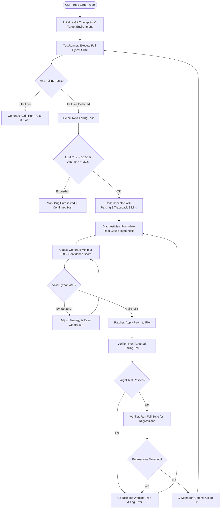

# DESIGN.md — Autonomous Bug Fixer Agent System Design

## 1. Architecture Overview
The **Autonomous Bug Fixer Agent** is a resilient, closed-loop software engineering system engineered to autonomously diagnose, localize, patch, and verify software bugs in Python codebases without human intervention.

The platform is designed around strict separation of concerns:
- **Deterministic Python Tools**: Subprocess test runners, AST code inspectors, pre-validated patch appliers, and atomic Git rollback guards.
- **Agentic LLM Reasoning**: Root-cause hypothesis formulation, minimal diff generation, confidence scoring, and dynamic retry adaptation.

---

## 2. Agent Loop & Control Flow
The agent follows a deterministic state-machine cycle:
1. **Observe**: Run `pytest` via `TestRunner` with a subprocess timeout. Parse stdout/stderr into structured `TestSuiteReport` and individual `TestCaseResult` objects.
2. **Prioritize**: Iterate through failing tests one by one.
3. **Inspect**: `CodeInspector` extracts targeted code slices surrounding the failure traceback, AST definitions, imports, and API contracts without flooding LLM context.
4. **Diagnose**: `Diagnostician` analyzes the stacktrace, assertion error, and code slice to produce a structured `RootCauseAnalysis`.
5. **Patch**: `Coder` generates a minimal, precision patch with a self-assessed `confidence_score` (0.0 to 1.0) and rationale.
6. **Validate & Apply**: `Patcher` verifies Python AST syntax before modifying files.
7. **Dual-Stage Verification**:
   - *Stage 1*: Run the specific target test.
   - *Stage 2*: Run the complete test suite. If any previously passing test fails (regression), the fix is rejected immediately.
8. **Rollback & Recovery**: If a patch fails or regresses, `GitManager` executes an atomic rollback (`git checkout -- .`), records the failure details, and re-prompts the agent with prior attempt context.
9. **Final Audit**: Exports `run_trace.json` and renders a Rich terminal summary table with token and cost breakdown.

---

## 3. Tool & Function Design
| Tool | Deterministic / LLM | Purpose & Safety Mechanisms |
|---|---|---|
| `TestRunner` | Deterministic | Executes `uv run pytest -v --tb=short` in target directory with 30s timeout; parses machine-readable test results. |
| `CodeInspector` | Deterministic | AST-driven symbol extraction and targeted source window retrieval (+/- 30 lines) to minimize prompt token count. |
| `Patcher` | Deterministic | Pre-validates modifications using `ast.parse()`; applies unified diffs or safe snippet replacements with in-memory backups. |
| `GitManager` | Deterministic | Creates clean working tree checkpoints, commits successful fixes, and performs atomic rollbacks on regression. |
| `LLMClient` | LLM Gateway | Manages Google Gemini and Groq API connections with multi-key rotation and token/cost tracking. |
| `Diagnostician` | LLM Reasoning | Formulates structured JSON root-cause hypotheses based strictly on tracebacks and code context. |
| `Coder` | LLM Reasoning | Generates minimal unified diffs and confidence ratings. |
| `Verifier` | Deterministic | Orchestrates target vs full test execution to enforce zero-regression contracts. |

---

## 4. Error Recovery & Retry Strategy
- **Atomic Rollback**: On any failed patch or test regression, the working tree is instantly restored to its clean git commit state.
- **Iterative Feedback Loop**: Prior failure messages and stacktraces are injected into subsequent LLM prompts as negative examples.
- **Attempt Budgeting**: Enforces a strict maximum attempt limit (default: 3 attempts per bug) to prevent infinite loops.

---

## 5. LLM Selection, Routing & Cost Management
- **Primary Engines**: Google Gemini (`gemini-flash-latest`, `gemini-2.5-flash`) & Groq (`llama-3.3-70b-versatile`).
- **Key Rotation**: Automatically cycles across secondary and tertiary API keys on HTTP 429 / quota limits.
- **Cost Efficiency**:
  - Gemini Flash: $0.075 / 1M prompt tokens, $0.30 / 1M completion tokens.
  - Groq Llama 3.3 70B: $0.59 / 1M prompt tokens, $0.79 / 1M completion tokens.
  - Strict targeted context retrieval keeps total run spend under **$0.05** (well within the $5.00 limit).

---

## 6. Security Considerations
- **No Unsafe Execution**: The agent never executes arbitrary model-generated shell commands.
- **Target Sandboxing**: File modifications are restricted strictly to relative paths within the target repository.
- **AST Pre-validation**: Protects against syntax corruption or malformed payloads before disk writes.

---

## 7. Future Improvements
1. **Containerized Sandboxing**: Run target test execution inside isolated ephemeral Docker containers.
2. **Semantic Code Search**: Integrate tree-sitter or vector indexing for large multi-package codebases (>50,000 LOC).
3. **Automated PR Generation**: Auto-open GitHub pull requests with generated diffs, confidence ratings, and reasoning traces.
